<p align="center">

```
╔═╗╦╔═╦╦  ╦  ╔═╗╔╦╗╦╔╦╗╦ ╦
╚═╗╠╩╗║║  ║  ╚═╗║║║║ ║ ╠═╣
╚═╝╩ ╩╩╩═╝╩═╝╚═╝╩ ╩╩ ╩ ╩ ╩
```

**Forge once, export everywhere.**

</p>

Forge AI coding skills once, export to Claude, Cursor, Windsurf, GitHub Copilot, and Codex.

<p align="center">
  
</p>

## Why?

In a typical dev team, everyone has their favorite AI coding assistant. One person swears by Claude Code, another lives in Cursor, someone else just switched to Windsurf, and the rest of the team is on Copilot. The problem? Each tool uses its own format for "skills" or "rules" — slightly different YAML frontmatter, different file locations, different naming conventions.

What starts as a single coding standard document quickly turns into five copies scattered across `.claude/skills/`, `.cursor/rules/`, `.windsurf/rules/`, `.github/instructions/`, and `AGENTS.md`. Every time you update one, the others fall behind. You end up maintaining five versions of the same thing, and inevitably they drift apart.

We ran into this exact problem. We had a growing collection of coding skills — TypeScript conventions, code review guidelines, testing patterns — and keeping them in sync across tools was becoming a real pain. So we built this.

**Skill Template Engine** lets you maintain each skill as a single Markdown file in a universal format. When you need to install it into a project, you just run one command and pick your vendor. The engine handles the translation — mapping `activation: auto` to Cursor's `alwaysApply: false` or Windsurf's `trigger: model_decision`, putting files in the right directories, adapting frontmatter fields.

One source of truth. No duplication. No drift.

## Supported Vendors

| Vendor | Output Path | Key Metadata |
|--------|-------------|--------------|
| Claude Code | `.claude/skills/{name}/SKILL.md` | `name`, `description`, `allowed-tools`, `user-invocable` |
| Cursor | `.cursor/rules/{name}/RULE.md` | `description`, `globs`, `alwaysApply` |
| Windsurf | `.windsurf/rules/{name}.md` | `description`, `trigger`, `globs` |
| GitHub Copilot | `.github/instructions/{name}.instructions.md` | `applyTo` |
| Codex (AGENTS.md) | `AGENTS.md` | Section-based (`## {name}`) |

## Installation

```bash
npm install -g skillsmith
```

Or use directly with `npx`:

```bash
npx skillsmith <command>
```

## Quick Start

### 1. Create a skill

```bash
npx skillsmith init typescript-standards
```

This creates `typescript-standards/skill.md`:

```markdown
---
name: typescript-standards
description: Describe what this skill does
globs: "**/*.ts"
activation: auto
---

Add your skill instructions here.
```

### 2. Edit the skill

```markdown
---
name: typescript-standards
description: Enforce TypeScript coding standards and best practices
globs: "**/*.ts,**/*.tsx"
activation: auto
allowed-tools: "Read Grep"
---

# TypeScript Standards

## Coding Rules

- Use `const` by default, `let` when reassignment is needed, never `var`
- Prefer `interface` over `type` for object shapes
- Always handle Promise rejections
- Use explicit return types on exported functions

## Naming Conventions

- PascalCase for types, interfaces, enums, and classes
- camelCase for variables, functions, and methods
- UPPER_SNAKE_CASE for constants
```

### 3. Export to a vendor

```bash
# Single vendor
npx skillsmith add ./typescript-standards -a claude
npx skillsmith add ./typescript-standards -a cursor

# All vendors at once
npx skillsmith add ./typescript-standards -a all
```

## Universal Skill Format

Each skill is a Markdown file with YAML frontmatter:

```yaml
---
name: my-skill            # Required — unique skill identifier
description: What it does  # Required — used by AI to decide when to apply
globs: "**/*.ts"           # Optional — file patterns for scoping
activation: auto           # Optional — auto | manual | always
allowed-tools: "Read Grep" # Optional — Claude-specific tool allowlist
---

Markdown body with instructions for the AI assistant...
```

### Fields

| Field | Required | Description |
|-------|----------|-------------|
| `name` | Yes | Unique identifier, used as filename/section heading |
| `description` | Yes | What the skill does — AI uses this to decide relevance |
| `globs` | No | Comma-separated glob patterns (e.g. `"**/*.ts,**/*.tsx"`) |
| `activation` | No | `auto` (AI decides), `manual` (user invokes), `always` (always active) |
| `allowed-tools` | No | Space-separated tool names (Claude-specific, ignored by other vendors) |

### Activation Mapping

The `activation` field maps intelligently to each vendor's native concept:

| `activation` | Claude | Cursor | Windsurf | Copilot | Codex |
|--------------|--------|--------|----------|---------|-------|
| `always` | auto-applied | `alwaysApply: true` | `trigger: always_on` | `applyTo: "**"` | always in file |
| `auto` | `user-invocable: true` | `alwaysApply: false` | `trigger: model_decision` | uses `globs` | in file |
| `manual` | `user-invocable: true` | `alwaysApply: false` | `trigger: manual` | uses `globs` | in file |

When `globs` is set, Windsurf uses `trigger: glob` regardless of `activation`.

### Skill as a Directory

A skill can also be a directory with bundled resources (currently only supported by Claude):

```
my-skill/
  skill.md              # Skill definition
  scripts/              # Helper scripts
    validate.sh
  references/           # Reference documents
    style-guide.md
  assets/               # Other files
    config.json
```

```bash
npx skillsmith add ./my-skill -a claude
# Resources are copied to .claude/skills/my-skill/

npx skillsmith add ./my-skill -a cursor
# ⚠ cursor does not support bundled resources. Scripts/references/assets were not exported.
```

## CLI Reference

### `add <skillpath> -a <vendor>`

Export a skill to a specific vendor format.

```bash
npx skillsmith add ./my-skill -a claude
npx skillsmith add ./my-skill/skill.md -a windsurf
npx skillsmith add ./my-skill -a all
```

**Vendors:** `claude`, `cursor`, `windsurf`, `copilot`, `codex`, `all`

Every `add` call automatically tracks the skill in `.skillsmith.json` — source path, vendors, timestamps. This is what makes `sync` possible later.

### `sync`

Re-export all tracked skills from their original sources. Run this after someone updates a skill in your central repository:

```bash
npx skillsmith sync
```

Output:

```
Syncing 3 skill(s)...

↻ typescript-standards
  ✓ claude → .claude/skills/typescript-standards/SKILL.md
  ✓ cursor → .cursor/rules/typescript-standards/RULE.md
↻ code-review
  ✓ claude → .claude/skills/code-review/SKILL.md
↻ react-patterns
  ✓ cursor → .cursor/rules/react-patterns/RULE.md

Sync complete: 3 updated, 0 failed.
```

If a source path no longer exists (e.g. submodule not checked out), `sync` reports the error and continues with the rest.

### `init [name]`

Scaffold a new skill with a template `skill.md`.

```bash
npx skillsmith init react-patterns
# Creates react-patterns/skill.md
```

### `export <skillpath> [skillpath...]`

Export one or more skills to all vendor formats at once.

```bash
npx skillsmith export ./typescript-standards ./react-patterns
```

### `list`

Scan the current project for existing vendor-specific skill files.

```bash
npx skillsmith list
```

Output:

```
Claude:
  .claude/skills/typescript-standards/SKILL.md

Cursor:
  .cursor/rules/typescript-standards

Windsurf:
  .windsurf/rules/typescript-standards.md

Copilot:
  .github/instructions/typescript-standards.instructions.md

Codex:
  AGENTS.md
```

## Programmatic API

```typescript
import { parseSkill, getAdapter, getAllAdapters } from 'skillsmith';

const skill = await parseSkill('./my-skill');

// Export to a single vendor
const adapter = getAdapter('claude');
const result = await adapter.export(skill, {
  vendor: 'claude',
  projectRoot: '/path/to/project',
});

console.log(result.files);    // Files written
console.log(result.warnings); // Non-fatal issues

// Export to all vendors
for (const adapter of getAllAdapters()) {
  await adapter.export(skill, {
    vendor: adapter.vendor,
    projectRoot: '/path/to/project',
  });
}
```

## Example: Export Output

Given this `skill.md`:

```markdown
---
name: code-review
description: Guidelines for reviewing pull requests
globs: "**/*.ts,**/*.tsx"
activation: auto
---

Review code for correctness, readability, and performance.
Always check for proper error handling.
```

**Claude** (`.claude/skills/code-review/SKILL.md`):

```yaml
---
name: code-review
description: Guidelines for reviewing pull requests
user-invocable: true
---
```

**Cursor** (`.cursor/rules/code-review/RULE.md`):

```yaml
---
description: Guidelines for reviewing pull requests
globs: "**/*.ts,**/*.tsx"
alwaysApply: false
---
```

**Windsurf** (`.windsurf/rules/code-review.md`):

```yaml
---
description: Guidelines for reviewing pull requests
trigger: glob
globs: "**/*.ts,**/*.tsx"
---
```

**Copilot** (`.github/instructions/code-review.instructions.md`):

```yaml
---
applyTo: "**/*.ts,**/*.tsx"
---
```

**Codex** (`AGENTS.md`):

```markdown
## code-review

Guidelines for reviewing pull requests

Review code for correctness, readability, and performance.
Always check for proper error handling.
```

## Organization Skill Repository

The real power of Skill Template Engine comes when you centralize your skills in a shared repository and distribute them across all your projects.

### Setting Up a Skill Repository

Create a dedicated git repo for your organization's skills:

```
your-org/ai-skills/
  skills/
    typescript-standards/
      skill.md
    code-review/
      skill.md
      references/
        checklist.md
    react-patterns/
      skill.md
    security-rules/
      skill.md
    testing-conventions/
      skill.md
  package.json
  README.md
```

Each skill lives in its own directory with a `skill.md` and optional resources. This repo becomes the single source of truth for your entire organization.

### Installing Skills Into a Project

Once your skill repo is published (npm, GitHub, or just cloned locally), installing skills into any project is a one-liner:

```bash
# From a local clone
npx skillsmith add ../ai-skills/skills/typescript-standards -a cursor

# From a cloned repo — install all skills at once
for skill in ../ai-skills/skills/*/; do
  npx skillsmith add "$skill" -a claude
done

# Export a specific skill to all vendors
npx skillsmith add ../ai-skills/skills/code-review -a all
```

You can also add a helper script to your skill repo's `package.json`:

```json
{
  "name": "@your-org/ai-skills",
  "scripts": {
    "install-skills": "node scripts/install.mjs"
  }
}
```

```javascript
// scripts/install.mjs
import { parseSkill, getAdapter } from 'skillsmith';
import { readdirSync } from 'node:fs';
import { resolve } from 'node:path';

const vendor = process.argv[2] || 'claude';
const projectRoot = process.argv[3] || process.cwd();
const skillsDir = resolve(import.meta.dirname, '../skills');

for (const entry of readdirSync(skillsDir, { withFileTypes: true })) {
  if (!entry.isDirectory()) continue;

  const skill = await parseSkill(resolve(skillsDir, entry.name));
  const adapter = getAdapter(vendor);
  const result = await adapter.export(skill, { vendor, projectRoot });

  console.log(`${skill.name} → ${result.files.join(', ')}`);
}
```

### Keeping Skills Up to Date

The trickiest part of shared skills is keeping them in sync. When someone updates a skill in the central repo, every project that uses it should pick up the change.

The engine solves this with `.skillsmith.json` — a lockfile that `add` creates automatically. It tracks which skills are installed, where they came from, and for which vendors:

```json
{
  "skills": {
    "typescript-standards": {
      "source": "/Users/dev/ai-skills/skills/typescript-standards",
      "vendors": ["claude", "cursor"],
      "installedAt": "2025-06-01T10:00:00.000Z",
      "updatedAt": "2025-06-15T14:30:00.000Z"
    },
    "code-review": {
      "source": "/Users/dev/ai-skills/skills/code-review",
      "vendors": ["claude"],
      "installedAt": "2025-06-01T10:00:00.000Z",
      "updatedAt": "2025-06-01T10:00:00.000Z"
    }
  }
}
```

When you update a skill in the central repo, pull the latest and run `sync` in each project:

```bash
cd ai-skills && git pull          # pull latest skill definitions
cd ../my-project
npx skillsmith sync    # re-export everything from .skillsmith.json
```

That's it. `sync` reads `.skillsmith.json`, re-parses each skill from its source, and re-exports to all tracked vendors.

#### Automate It

You don't want to do this manually across 20 projects. Pick a strategy:

**CI Pipeline (recommended)** — a GitHub Action that runs weekly, syncs skills, and opens a PR:

```yaml
# .github/workflows/sync-skills.yml
name: Sync AI Skills
on:
  schedule:
    - cron: '0 8 * * 1'  # Every Monday at 8:00
  workflow_dispatch:       # Or trigger manually

jobs:
  sync:
    runs-on: ubuntu-latest
    steps:
      - uses: actions/checkout@v4

      - uses: actions/checkout@v4
        with:
          repository: your-org/ai-skills
          path: .ai-skills

      - run: npm install -g skillsmith
      - run: npx skillsmith sync

      - uses: peter-evans/create-pull-request@v6
        with:
          title: "chore: sync AI coding skills"
          body: "Automated sync from your-org/ai-skills"
          branch: chore/sync-ai-skills
```

**Git Submodule** — keep skills as a submodule, sync via Makefile:

```bash
git submodule add git@github.com:your-org/ai-skills.git .ai-skills
```

```makefile
sync-skills:
	git submodule update --remote .ai-skills
	npx skillsmith sync
```

```bash
make sync-skills
```

**npm Package** — publish skills as `@your-org/ai-skills`, re-export on install:

```json
{
  "devDependencies": {
    "@your-org/ai-skills": "^1.0.0",
    "skillsmith": "^0.1.0"
  },
  "scripts": {
    "postinstall": "npx skillsmith sync"
  }
}
```

Version bumps propagate through Dependabot or Renovate. Every `npm install` re-syncs automatically.

### Multi-Vendor Projects

In teams where different people use different tools, export to all vendors at once and commit the results. This way everyone gets the same rules regardless of their editor:

```bash
# Install script that covers the whole team
for skill in .ai-skills/skills/*/; do
  npx skillsmith add "$skill" -a all
done
```

The exported files are small and readable, so committing them to the repo is fine. The diff in PRs clearly shows what changed in the skill definitions.

### Recommended Workflow

```
┌─────────────────────────────────────┐
│  your-org/ai-skills (central repo)  │
│                                     │
│  skills/                            │
│    typescript-standards/skill.md    │
│    code-review/skill.md             │
│    react-patterns/skill.md          │
│    ...                              │
└──────────────┬──────────────────────┘
               │
       CI sync / submodule / npm
               │
    ┌──────────┼──────────┐
    ▼          ▼          ▼
 project-a  project-b  project-c
 (Cursor)   (Claude)   (mixed team)
 .cursor/   .claude/   .cursor/ + .claude/
 rules/     skills/    + .windsurf/ + ...
```

1. **Edit once** — update a skill in `your-org/ai-skills`
2. **Propagate** — CI, submodule update, or npm bump pushes changes to projects
3. **Export** — `skillsmith` generates the vendor-specific files
4. **Review** — PR shows exactly what changed in each vendor format
5. **Merge** — everyone's tools pick up the new rules immediately

## License

MIT
